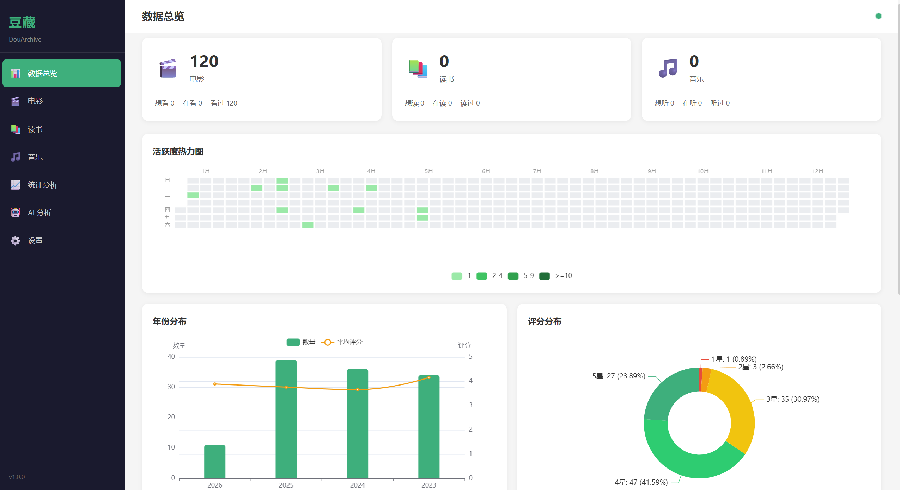
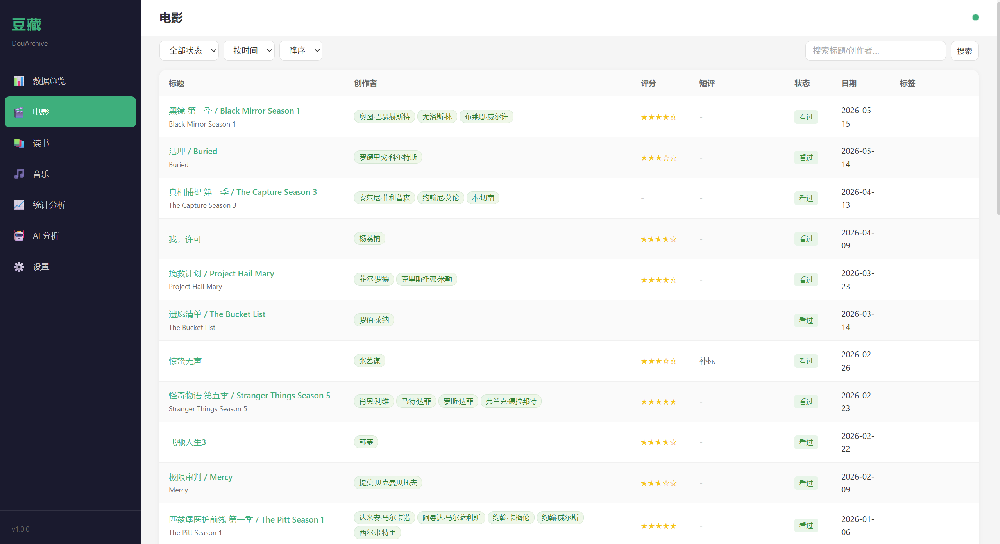
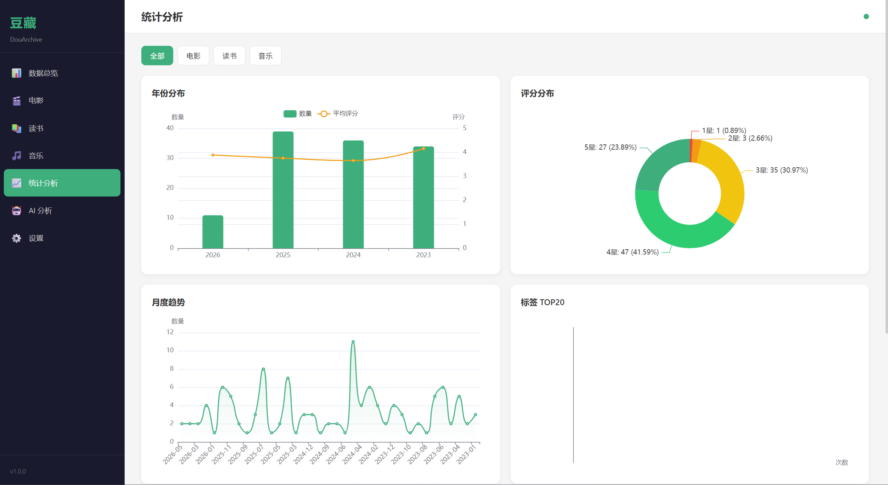
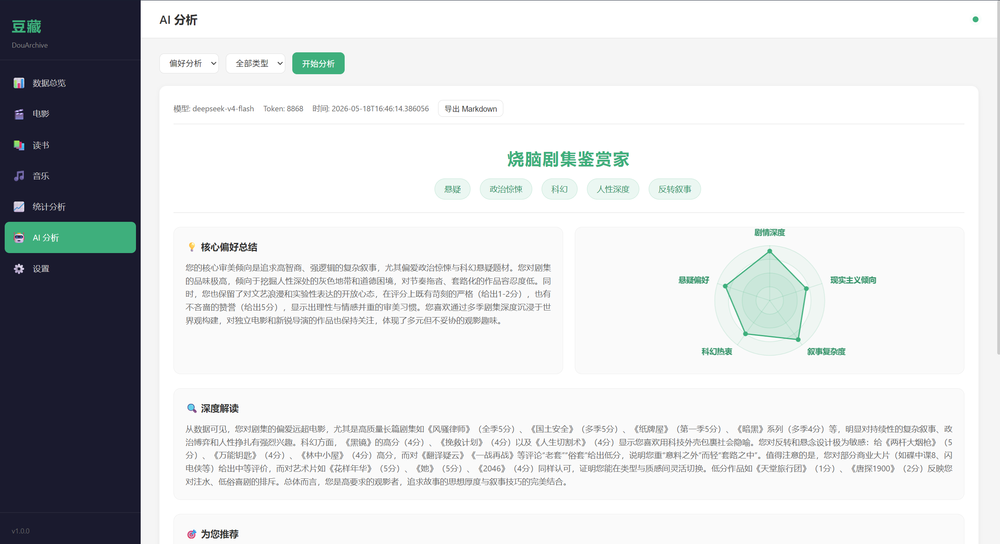

# 豆藏 DouArchive

> 纯本地运行 | 零数据上传 | 开源免费

备份你的豆瓣电影、读书、音乐标记数据，生成可视化统计，AI 深度分析个人偏好。所有数据永久留存本机，绝对隐私安全。


---

## 快速开始

### 第一步：安装油猴脚本

需要先安装 [Tampermonkey](https://www.tampermonkey.net/) 浏览器插件，然后点击下方链接安装脚本：

**[👉 点击安装 DouArchive 脚本](https://raw.githubusercontent.com/byJming/DouArchive/main/tampermonkey/douban-archiver.user.js)**

> 安装后访问豆瓣任意标记页面（如 `douban.com`），页面右下角会出现悬浮按钮。

### 第二步：启动后端

**方式一：下载 EXE（推荐，无需 Python）**

从 [Releases](https://github.com/byJming/DouArchive/releases) 页面下载 `DouArchive.exe`，双击运行，浏览器自动打开前端页面。

**方式二：从源码运行**

```bash
git clone https://github.com/byJming/DouArchive.git
cd DouArchive/backend
pip install -r requirements.txt
python main.py
```

### 第三步：采集数据

1. 访问豆瓣个人标记页面（电影/读书/音乐的"想看/在看/看过"）
2. 点击右下角悬浮按钮，展开操作面板
3. 选择要采集的任务，点击"开始采集"
4. 采集完成后点击"同步到后端"
5. 在前端页面查看统计图表和 AI 分析

---

## 功能特性

**数据采集**
- 豆瓣电影 / 读书 / 音乐三类标记数据完整抓取（共 9 种页面）
- 智能防封：随机延迟 2-5 秒，每 10 页冷却 30 秒
- 断点续传：中断后可恢复，支持批量任务队列
- 本地导出 JSON / Excel 格式

**可视化统计**
- 数据总览仪表盘（电影/读书/音乐数量统计）
- 年份分布、评分分布、月度趋势图表
- 标签词云、创作者排行榜
- 高级筛选与关键词搜索

**AI 分析**
- 个人偏好深度画像
- 基于历史数据的个性化推荐
- 支持 OpenAI 兼容 API 和 Ollama 本地模型
- 分析报告可导出 Markdown

---

## 界面预览

<p align="center">
  
  
  
  
</p>

---

## AI 配置

在前端设置页面配置 AI 参数：

| 配置项 | 说明 | 示例 |
|--------|------|------|
| AI 提供商 | 在线 API 或本地模型 | `openai` / `ollama` |
| API 密钥 | 你的 API Key | `sk-xxx` |
| Base URL | API 地址 | `https://api.openai.com/v1` |
| 模型名称 | 使用的模型 | `gpt-4o` |

### 使用 Ollama（离线模式）

```bash
# 安装 Ollama 后拉取模型
ollama pull qwen2.5

# 在设置页面填写：
# Base URL: http://localhost:11434/v1
# 模型: qwen2.5
```

---

## 隐私声明

本工具承诺：

- 全程无任何数据外发（除用户主动发起的 AI API 请求）
- 所有数据永久存储在用户本机
- AI 密钥加密存储
- 开源透明，可审计代码

---

## 开发者指南

### 技术架构

```
油猴脚本（数据采集）→ 本地 FastAPI 后端（数据处理与存储）→ 静态前端（可视化与交互）
```

| 层级 | 技术选择 |
|------|---------|
| 采集层 | 原生 JS + Tampermonkey + SheetJS |
| 后端层 | Python FastAPI + SQLite |
| 前端层 | Vue3（CDN）+ ECharts + 原生 CSS |
| AI 层 | 公有大模型 API + Ollama 本地模型 |

### 打包为 EXE

```bash
# 方式一：使用打包脚本
pwsh scripts/build-release.ps1

# 方式二：手动打包
cd backend
pip install -r requirements.txt
python build.py
```

输出文件：`backend/dist/DouArchive.exe`

### API 接口

| 接口 | 说明 |
|------|------|
| `POST /api/media/sync` | 批量同步数据（油猴脚本调用） |
| `GET /api/media` | 查询数据（支持筛选、分页） |
| `GET /api/stats/overview` | 总览统计 |
| `GET /api/stats/by-year` | 按年份统计 |
| `GET /api/stats/by-score` | 按评分统计 |
| `GET /api/stats/by-tag` | 按标签统计 |
| `GET /api/stats/by-creator` | 按创作者统计 |
| `POST /api/ai/analyze` | AI 分析 |
| `POST /api/ai/stream` | 流式 AI 分析（SSE） |
| `GET /api/ai/reports` | 历史报告列表 |
| `POST /api/export` | 数据导出（JSON/Excel/CSV） |
| `GET /api/config` | 获取配置 |
| `PUT /api/config` | 更新配置 |
| `GET /api/system/health` | 健康检查 |

### 项目结构

```
DouArchive/
├── backend/                 # 后端
│   ├── main.py              # FastAPI 入口
│   ├── database.py          # SQLite 数据库
│   ├── models.py            # 数据模型
│   ├── routers/             # API 路由
│   ├── services/            # 业务逻辑
│   ├── static/              # 前端文件
│   ├── data/                # 数据库文件（运行时生成）
│   ├── requirements.txt     # Python 依赖
│   └── build.py             # PyInstaller 打包
├── tampermonkey/            # 油猴脚本
│   └── douban-archiver.user.js
├── scripts/                 # 工具脚本
│   └── build-release.ps1    # 一键打包
├── LICENSE                  # 开源协议
└── README.md
```

---

## 开源协议

本项目采用 [PolyForm Noncommercial License 1.0.0](LICENSE) 协议。

允许个人使用、学术研究、非商业用途的修改和分发。禁止商业使用。
